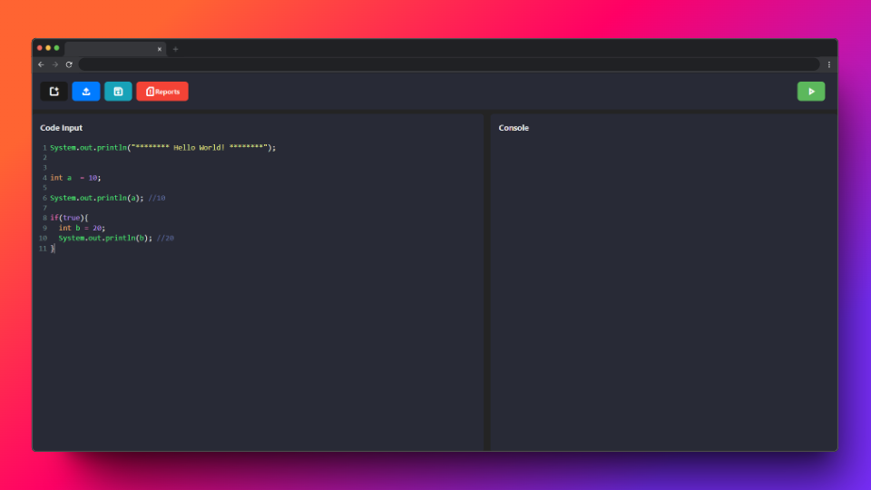

# <p align="center"> GUI_SimpleEditor </p>

<p align="center">
    Interfaz simple de un editor de código, hecho con HTML, JS, CSS.
</p>

<p align="center">
    
    <br>
    <text> Graphical User Interface </text>
</p>

## Características

- **Editor de código**: Utiliza CodeMirror para proporcionar una experiencia de edición de código enriquecida.
- **Soporte para Java**: El editor está configurado para resaltar la sintaxis del lenguaje Java.
- **Consola de salida**: Una consola de solo lectura para mostrar la salida del código.
- **Interfaz de usuario simple**: Botones para abrir archivos y limpiar el editor.

## Tecnologías Utilizadas

- **HTML**: Estructura de la página.
- **CSS**: Estilos y diseño de la interfaz.
- **JavaScript**: Lógica de la aplicación.
- **CodeMirror**: Biblioteca para la edición de código.


## Archivos Principales

- **index.html**: Contiene la estructura principal de la interfaz.
- **styles.css**: Define los estilos y el diseño de la interfaz.
- **script.js**: Contiene la lógica de inicialización de CodeMirror y la funcionalidad de los botones.

## Cómo Usar

1. **Abrir el Editor**: Simplemente abre el archivo `index.html` en tu navegador.
2. **Escribir Código**: Utiliza el área de texto principal para escribir tu código Java.
3. **Ver Salida**: La consola de salida mostrará cualquier resultado relevante.
4. **Limpiar Editor**: Usa el botón "New" para limpiar el contenido del editor.
5. **Abrir Archivos**: Usa el botón "Open" para cargar archivos en el editor.
6. **Guardar Archivos**: Usa el botón "Save" para descargar como archivo el contenido del editor.

## Configuración de CodeMirror

Para cambiar la sintaxis resaltada por CodeMirror, puedes modificar la configuración en el archivo `script.js`. Por ejemplo, para cambiar el modo de Java a JavaScript, puedes hacer lo siguiente:

```javascript
var editor = CodeMirror.fromTextArea(document.getElementById("code"), {
    lineNumbers: true,
    mode: "javascript", // Cambia "java" por "javascript"
    theme: "default"
});
```

## Requisitos

- Navegador web moderno.
- Conexión a internet para cargar las bibliotecas de CodeMirror.