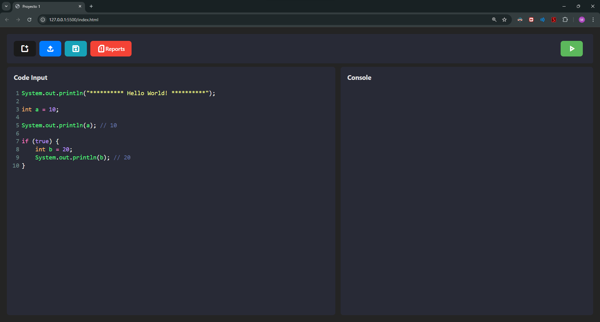

# <h1 align="center">GUI_SimpleEditor<h1>

## 
Simple interface of a code editor, made with HTML, JS, CSS   Interfaz simple de un editor de código, hecho con HTML, JS, CSS. 

    
     
    <text> Graphical User Interface </text>

